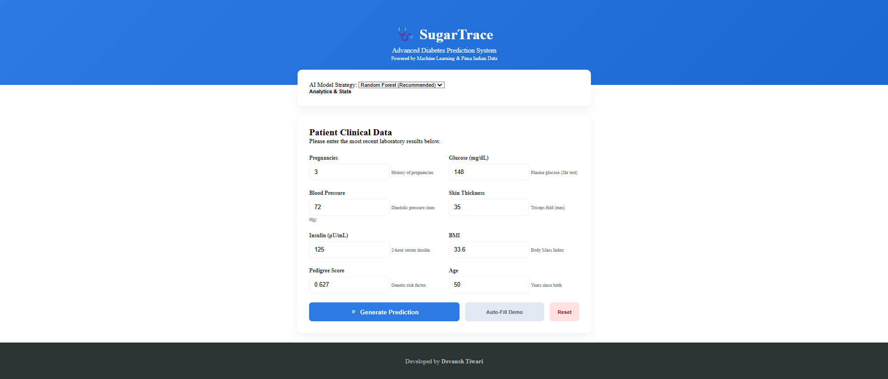

# 🩺 SugarTrace — Diabetes Prediction System

A simple student ML project that predicts whether a person is likely to have diabetes using basic health data.

---

## 🚀 What it does

* Takes 8 inputs (Glucose, BMI, Age, etc.)
* Predicts: **Diabetic / Not Diabetic**
* Shows:

  * Risk percentage
  * Risk level (Low / Moderate / High)
* Displays feature importance (Random Forest)
* Includes a basic web interface

---

## 📸 Proect Preview
<div align="center">
  <table>
     <td align="center"><b>Dashboard</b><br></td>
  </table>
</div>

---

## 🧠 Models Used

* Logistic Regression (baseline)
* Random Forest (better performance)

**Metrics used:**

* Accuracy
* Recall (important for medical cases)
* ROC-AUC

---

## 📁 Structure

```
SugarTrace/
├── train_model.py
├── preprocess.py
├── app.py
├── frontend/
├── models/
├── requirements.txt
└── README.md
```

---

## ⚙️ How to Run

```bash
pip install -r requirements.txt
python train_model.py
python app.py
```

Open: http://localhost:5000

---

## 🧹 Notes

* Zero values are treated as missing and replaced
* Features are scaled before prediction
* Code is kept simple (not overly optimized)

---

## ⚠️ Disclaimer

This is a student project and not meant for real medical use.

---

*Built with Python, Flask, and basic HTML/CSS/JS*

